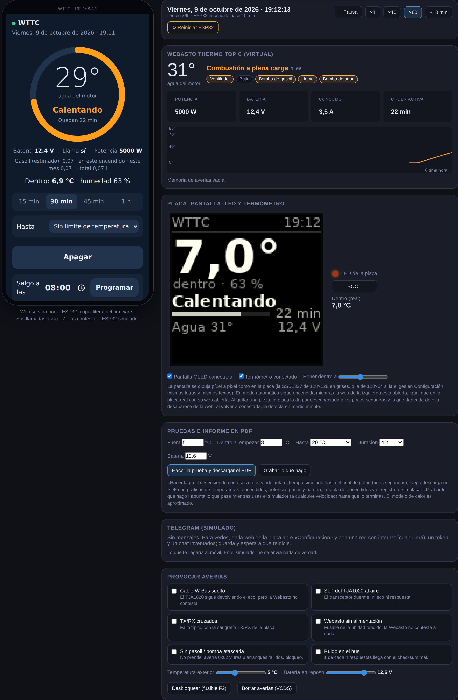
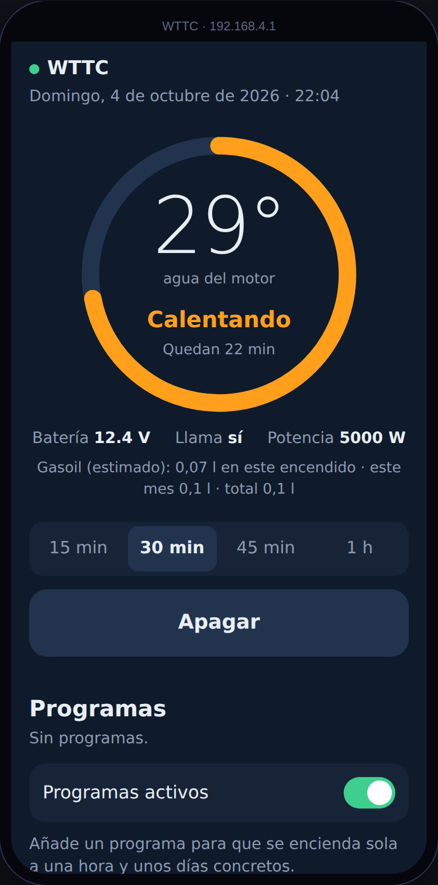
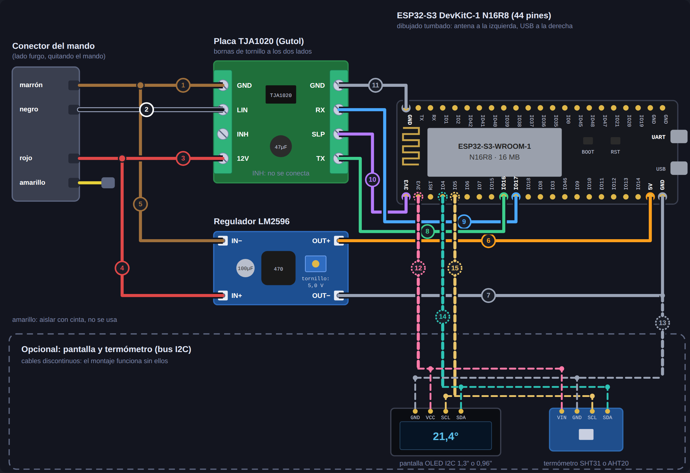
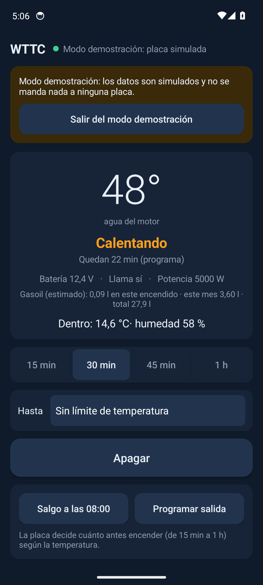
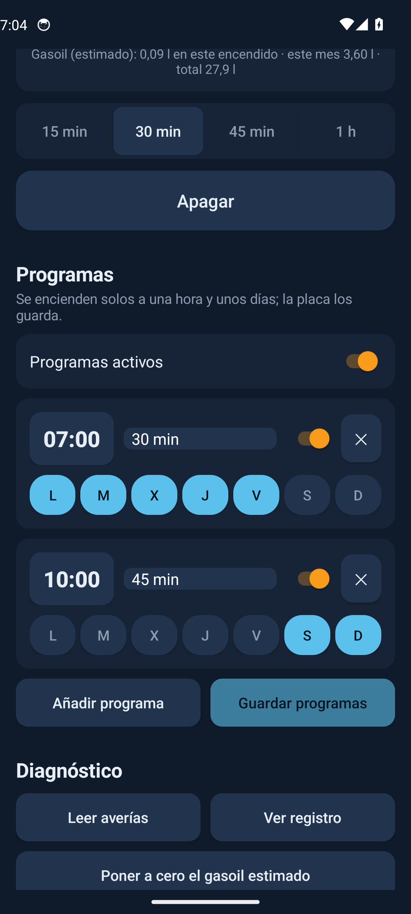
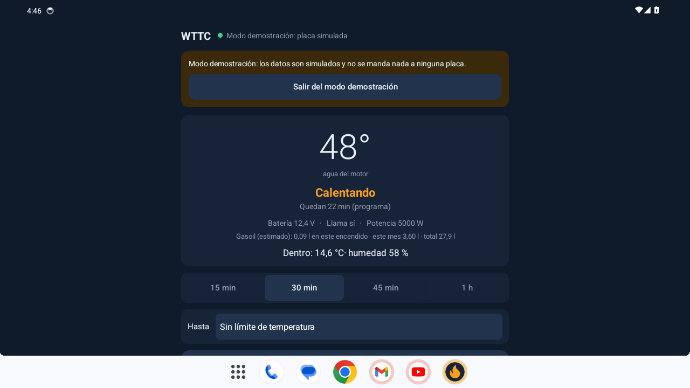
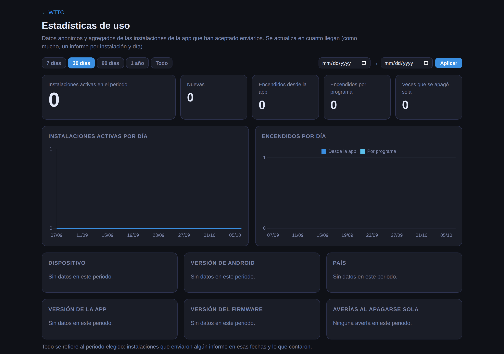

# WTTC — control por Bluetooth y Wi-Fi para la Webasto Thermo Top C

> 🤖 **Todo el código y el contenido de este repositorio están generados íntegramente con [Claude](https://claude.ai) (Anthropic)**:
> firmware del ESP32, app Android, servidor de estadísticas, web, workflows de compilación y documentación.
> El autor del proyecto ha dado las indicaciones; el código no está escrito a mano. Va comentado en abundancia a
> propósito, para que se pueda seguir y revisar.

Web con simulador, esquema y guías: **https://wttc.favala.es** · Versiones: [CHANGELOG.md](CHANGELOG.md) · Descargas: [Releases](../../releases)

Idiomas: firmware, app y web en español, inglés y alemán · *English: [wttc.favala.es/en](https://wttc.favala.es/en/)* ·
*Deutsch: [wttc.favala.es/de](https://wttc.favala.es/de/)*

Sustituye al temporizador original de la calefacción auxiliar **Webasto Thermo Top C** (la de agua que montan de
fábrica, por ejemplo, las VW T5) por un **ESP32** que habla su protocolo **W-Bus**. Se maneja desde una **app Android**
por Bluetooth o desde el navegador por Wi-Fi.

> Proyecto personal, sin relación con Webasto ni con Volkswagen. Úsalo bajo tu responsabilidad (ver la descarga de responsabilidad más abajo).
> WTTC no modifica la calefacción: le manda las mismas órdenes que su mando y sus protecciones internas (sobrecalentamiento,
> llama, tensión, bloqueo por fallos) siguen funcionando igual.

## ⚠️ Descarga de responsabilidad
Extracto; el texto completo está en https://wttc.favala.es/#responsabilidad (también en inglés y alemán).

- **Qué es.** WTTC es un proyecto personal, sin ánimo de lucro y gratuito de su autor (matatunos). No es un producto
  comercial: no se vende, no tiene servicio técnico y no ha superado ninguna homologación ni certificación.
- **Sin garantía.** Se ofrece *tal cual*, bajo la licencia GPL v3 (o posterior), sin garantía de ningún tipo. Mientras la versión empiece
  por 0 es **de prueba**: compila y se ha comprobado en el simulador, pero no se ha probado instalada con una Webasto real.
  La documentación técnica (cables, conexiones, consumos, códigos de avería) puede contener errores: compruébala antes de
  conectar nada.
- **Exclusión de responsabilidad.** En la máxima medida permitida por la ley, el autor no responde de ningún daño o
  perjuicio, directo o indirecto, derivado de descargar, instalar, usar o modificar el proyecto (entre otros: lesiones,
  intoxicación por monóxido de carbono, incendio, daños en la calefacción, el vehículo o su batería, pérdida de garantía o
  de seguro), ni del fallo de servicios de terceros de los que depende (GitHub, Telegram). No excluye la responsabilidad
  que la ley no permite excluir, como la derivada de dolo o culpa grave.
- **Responsabilidad del usuario.** Quien lo instala o lo usa lo hace bajo su exclusiva responsabilidad. **Nunca programes
  ni enciendas la calefacción con el vehículo en un garaje o recinto cerrado:** el monóxido de carbono no huele y puede ser
  mortal. Instálalo solo si sabes trabajar con seguridad en 12 V, pon un fusible de 1 A de acción lenta en el +12 V de la placa
  (aunque el del mando ya lleve otro mayor) y conserva siempre una forma de apagarla
  sin el proyecto.
- **Inteligencia artificial y marcas.** Todo el código y el contenido se han generado con Claude (Anthropic) y pueden
  contener errores no detectados. Webasto, Thermo Top, Volkswagen y el resto de marcas citadas son de sus titulares; el
  proyecto no tiene relación con ellos.

Descargar, instalar o usar el proyecto implica aceptar la descarga de responsabilidad completa y la licencia GPL v3.

## Capturas
Hechas automáticamente: la web con el simulador y la app en un emulador Android con la placa simulada (sin hardware).

| Simulador: la web de la placa y una Webasto virtual |
|---|
|  |

| Web de la placa (móvil) | Esquema de montaje |
|---|---|
|  |  |

| App Android (modo demostración) | Programas |
|---|---|
|  |  |

| App en una pantalla de radio de coche (1280×720) |
|---|
|  |

| Estadísticas públicas |
|---|
|  |

## Qué hace
- Encender y apagar (15–60 min) y hasta 8 programas semanales.
- **Hora de salida**: «salgo a las 8:00» (suelta o como programa) y la placa decide cuánto antes encender según el frío.
- Con el termómetro opcional, **calentar hasta una temperatura** (5–25 °C): apaga al llegar y vuelve a encender si se
  enfría (cada encendido dura como mínimo 15 min con el motor frío y 5 con el agua ya templada, desde 30 °C); si dentro no sube, se
  rinde y avisa en vez de gastar en balde.
- **Estado real**: arrancando, calentando, en pausa (agua caliente) o sin respuesta. Si la Webasto se apaga por su
  cuenta, lo detecta y muestra sus códigos de avería.
- Temperatura del agua, tensión de batería, llama y potencia.
- No arranca un programa si la batería está por debajo del mínimo configurado, y **apaga si baja calentando**.
- Aviso de **«ya está caliente»** cuando el agua llega a la temperatura elegida.
- **Bluetooth LE** con emparejamiento por PIN (generado al azar en cada placa) como vía principal.
- **Wi-Fi** propia como segunda opción, con portal cautivo (al conectarse, el móvil abre solo la web de la placa): siempre, solo mientras calienta o solo a petición (para gastar menos).
- Avisos opcionales por **Telegram** (bot propio) si el ESP32 llega a una red con internet.
- Opcional: **pantalla OLED** con el estado y la temperatura de dentro, y el **LED RGB** de la placa como piloto.
- **Acceso rápido** en Android: botón en los ajustes rápidos y widget para encender o apagar sin abrir la app.
- Todo se configura desde la app o la web, sin tocar el código. Lo que depende de una pieza opcional solo aparece si
  la placa la tiene conectada.

## Hardware
| Pieza | Modelo usado | Para qué |
|---|---|---|
| Calefactor | Webasto Thermo Top C de fábrica (ref. VW 7H0 010 398 J), mandada por W-Bus | Lo que se controla; el ESP32 se enchufa en el conector del temporizador original |
| Microcontrolador | **ESP32-S3 DevKitC-1 N16R8** (16 MB, mejor sobre base con bornas de tornillo; [ficha](docs/hardware/esp32-s3-n16r8/README.md)). Desde la 0.2.0, el único soportado | Bluetooth, Wi-Fi, programas y W-Bus por UART2 (IO16/IO17) |
| Transceptor | Módulo UART ↔ LIN/K-Line con **TJA1020** (o TJA1021, MCP2003, L9637D) | Adapta los 3,3 V del ESP32 al bus de un hilo a 12 V |
| Alimentación | Regulador **LM2596** ajustado a **5,0 V** | 5 V para el ESP32 desde el +12 V permanente |
| *Opcional:* pantalla | OLED I2C **SSD1327 de 1,5"** (128×128, 16 grises; recomendada) o de 128×64: 1,3" (SH1106) o 0,96" (SSD1306) | Estado, temperatura de dentro, agua, batería y lo siguiente que va a pasar |
| *Opcional:* termómetro | Módulo I2C **SHT31** o **AHT20** | Temperatura y humedad de dentro; «calentar hasta X °C» |

Conexiones: +12 V permanente y masa del conector a la placa TJA1020 y al LM2596; W-Bus a la borna LIN; TX de la placa
a IO16, RX a IO17, SLP a 3V3. El cable de contacto (borne 15) no se usa. Opcionales, en el mismo bus I2C: pantalla y
termómetro a 3V3, GND, **IO4 (SDA)** e **IO5 (SCL)**; la placa los detecta sola. **Mide los cables con el polímetro**: los
colores cambian entre vehículos.

**Antes de montar, comprueba que tu calefacción habla W-Bus.** La de las T5 con temporizador de fábrica lo hace, pero se
dice que algunas Thermo Top C antiguas usan otro protocolo. La primera prueba por la consola serie (`status` y
`errores`) solo lee datos y no enciende nada: si la Webasto contesta con su temperatura y tensión, adelante.

## Instalar el firmware
1. Arduino IDE 2 (o arduino-cli) con el núcleo **esp32 de Espressif** (2.x o 3.x). Sin librerías externas.
2. Placa **ESP32S3 Dev Module** con **Flash Size 16MB**, **PSRAM «OPI PSRAM»** y esquema de partición
   **Huge APP**. Ese esquema solo fija el límite de tamaño del IDE: la tabla que se graba es `partitions.csv` de la
   carpeta, con dos huecos para las actualizaciones sin cable.
3. Abre `firmware/WTTC/WTTC.ino` (la carpeta entera: lleva también `web.h`, `partitions.csv` y `rollback.cpp`) y
   súbelo. En el ESP32-S3, por el USB marcado **UART** o **COM**. En el monitor serie (115200) aparece el **PIN Bluetooth**.

```sh
arduino-cli compile --fqbn esp32:esp32:esp32s3:FlashSize=16M,PSRAM=opi,PartitionScheme=huge_app firmware/WTTC
arduino-cli upload  --fqbn esp32:esp32:esp32s3:FlashSize=16M,PSRAM=opi,PartitionScheme=huge_app -p /dev/ttyUSB0 firmware/WTTC
```

Después, las versiones nuevas se instalan sin cable: app o web de la placa → **Buscar actualizaciones**.

Más fácil: **instalar desde el navegador** en https://wttc.favala.es/instalar.php (Chrome o Edge, la placa por USB).

Cada cambio se compila automáticamente en GitHub Actions para ESP32-S3, con el núcleo 3.3.12 (el 2.x no está soportado desde la 0.3.0).

## App Android
Se descarga como APK en [Releases](../../releases). Busca el ESP32 por Bluetooth, empareja con el PIN y se conecta
sola cuando está cerca. Sin nada montado, **«Probar sin placa»** abre un modo demostración con una placa simulada.

> **Versiones 0.x = de prueba**: compilan y funcionan en el simulador, pero aún no se han probado con una Webasto real. Funciona también en radios Android de coche si su Bluetooth es visible para las apps (compruébalo
antes con «nRF Connect»: si ve dispositivos BLE, la app funcionará).

## Estadísticas anónimas
La app pregunta al abrirla por primera vez si quieres enviar estadísticas anónimas (dos botones iguales, nada marcado de
antemano). Qué se envía, qué no y el código del servidor: [`server/`](server/). Resultados públicos en
https://wttc.favala.es/estadisticas.php

## Protocolo W-Bus
2400 baudios 8E1, un solo hilo (cada byte enviado vuelve como eco). Trama `F4 LL CMD DATOS… XOR`; respuesta `4F LL
CMD|0x80 DATOS… XOR`. Órdenes usadas: `0x21` encender (minutos), `0x44` mantener (cada 5 s), `0x10` apagar,
`0x50 05` sensores, `0x56 01` averías. Basado en la documentación del proyecto libwbus.

## Versiones
Firmware y app llevan el mismo número, el del fichero [`VERSION`](VERSION). Cada versión nueva tiene su sección en
[`CHANGELOG.md`](CHANGELOG.md) y, al subirla, GitHub Actions publica la Release con el APK y el firmware.

## Licencia
WTTC es **software libre** — Copyright (C) 2026 matatunos — bajo la **GNU General Public License v3 o posterior**
(`GPL-3.0-or-later`, texto completo en [LICENSE](LICENSE)). Se puede usar, estudiar, modificar y distribuir, también
vendido; pero quien distribuya una versión, modificada o no (firmware, APK, código), tiene que hacerlo con esta misma
licencia y dar su código fuente. Así el proyecto y sus derivados siguen siendo libres.

Hasta la versión 0.2.6 el proyecto se publicó con licencia MIT: esas versiones siguen teniéndola. Desde la 0.2.7, GPL v3.
Lo que usa por dentro es compatible: núcleo Arduino del ESP32 (LGPL 2.1), ESP-IDF y ESP Web Tools (Apache 2.0), jsPDF
(MIT, en la web) y las letras DejaVu (licencia Bitstream Vera, ver `firmware/WTTC/fuentes.h`).

Código generado con Claude (Anthropic).


<!-- Security scan triggered at 2026-10-07 11:18:53 -->