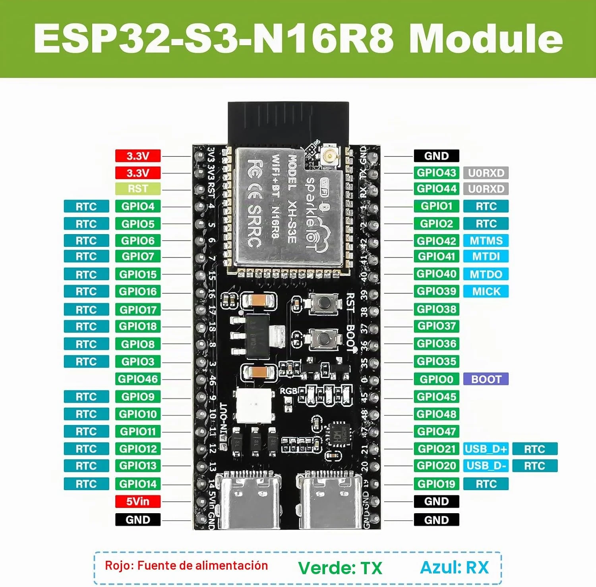
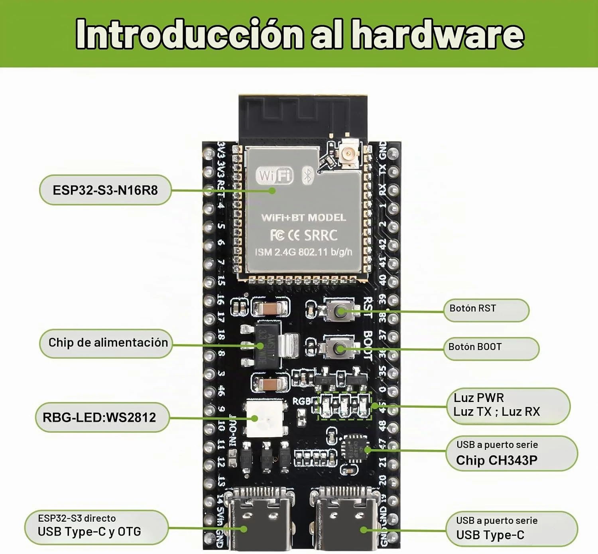
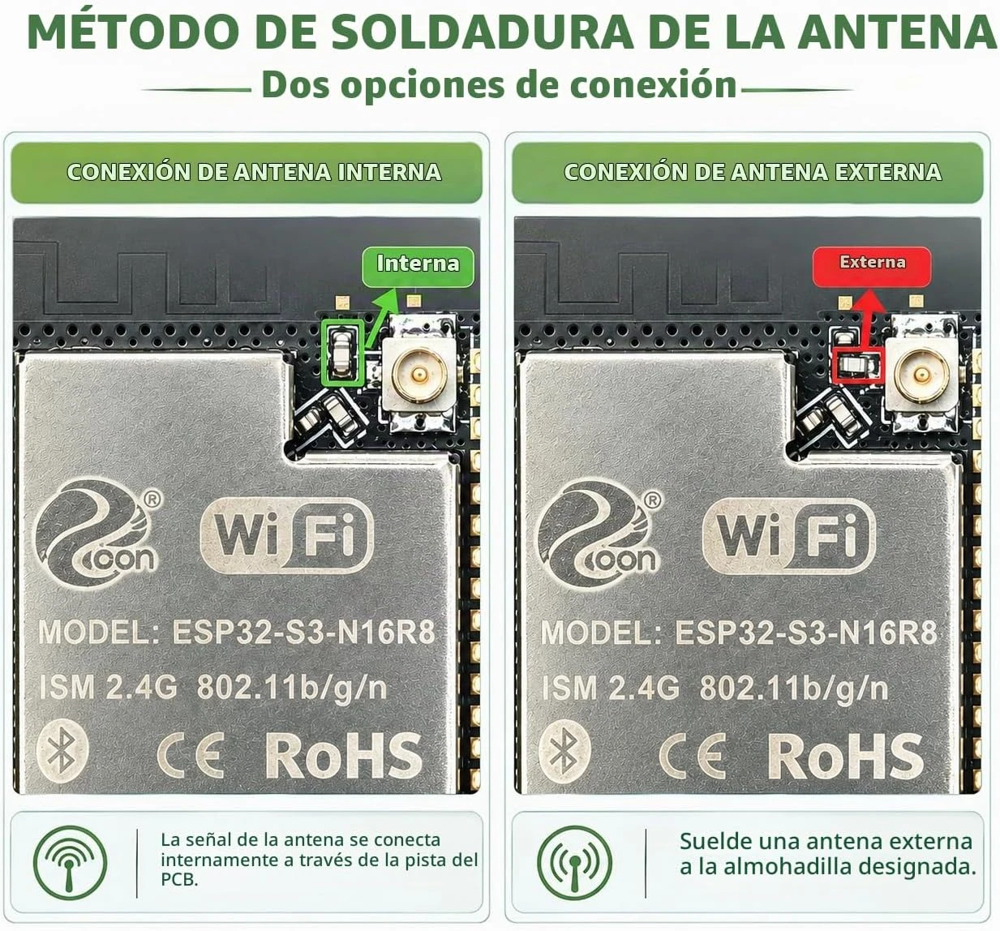

# Placa ESP32-S3 N16R8 (diymore)

La placa de referencia de WTTC. Documentación del vendedor guardada para no depender de la página de la tienda.
Notas escritas con Claude (Anthropic) a partir de esas imágenes; lo marcado «sin comprobar» hay que verificarlo con la
placa en la mano.

- **Producto:** diymore «Placa de desarrollo ESP32-S3-DevKitC-1 N16R8», Amazon ASIN **B0GYCQ2GBB**
  (<https://www.amazon.es/dp/B0GYCQ2GBB>). Hay variantes de la misma ficha (una unidad, dos unidades, con base de
  bornas); el ASIN identifica la ficha, no siempre la variante exacta.
- **Es un clon de la ESP32-S3-DevKitC-1** de Espressif: mismo patillaje (44 pines), mismo tamaño. No es idéntica:
  cambia el conversor USB-serie y algún detalle (abajo).

## Imágenes del vendedor

| Patillaje | Componentes | Antena |
|---|---|---|
|  |  |  |

En la imagen del patillaje, GPIO43 aparece como «U0RXD»: es un error de la imagen, GPIO43 es **U0TXD** (pin TX).

## Lo que importa para WTTC

| Pin de la placa | Uso en WTTC | Cable del esquema |
|---|---|---|
| **5Vin** | Entrada de 5 V del LM2596 | ⑥ |
| **GND** (junto a 5Vin) | Masa del LM2596 | ⑦ |
| **GPIO16** | TX del ESP32 → TX de la placa TJA1020 | ⑧ |
| **GPIO17** | RX del ESP32 ← RX de la placa TJA1020 | ⑨ |
| **3V3** | SLP de la TJA1020 | ⑩ |
| **GND** (lado derecho, arriba) | Masa de la TJA1020 | ⑪ |

Todos los pines que usa WTTC están en el **lado izquierdo** (visto con la antena arriba), salvo una masa.

## Componentes

- **Módulo ESP32-S3 N16R8:** 16 MB de flash y 8 MB de PSRAM octal. Con la PSRAM octal, los **GPIO35, 36 y 37 están
  ocupados** por la memoria: no usarlos para nada.
- **Regulador AMS1117-3.3:** de 5Vin (o del USB) saca los 3,3 V. Admite como mucho unos 15 V en la entrada según su
  hoja de datos, pero se calienta mucho: por eso WTTC le da 5 V del LM2596 y nunca 12 V directos.
- **Dos USB-C:**
  - el de la **derecha** (visto con la antena arriba) va al **CH343P**, conversor USB-serie: es el que se usa para
    programar y para la consola (el «UART/COM» de las instrucciones). Necesita el driver CH343 en Windows si no lo
    instala solo.
  - el de la **izquierda** es el **USB nativo** del ESP32-S3 (GPIO19/20, con OTG). WTTC no lo usa.
- **Diodos marcados «SL»** junto a los USB y un puente **IN-OUT** sin soldar: parecen separar la alimentación del USB
  de la de 5Vin, como en la placa de Espressif (sin comprobar). Mientras no se compruebe, **no conectar el USB con la
  placa alimentada por el LM2596**, y no soldar el puente IN-OUT.
- **LED RGB WS2812** («RGB»): direccionable, un solo hilo de datos. En la DevKitC-1 de Espressif va al **GPIO48**
  (v1.0) o al **GPIO38** (v1.1); en esta placa, por la serigrafía, parece el 48 (sin comprobar). WTTC aún no lo usa.
- **LED de encendido y LEDs TX/RX** del CH343P.
- **Botones:** **BOOT** (GPIO0; mantenerlo pulsado al conectar si no entra a grabar sola) y **RST** (reinicio).

## Antena

Lleva **antena impresa** en la placa y un **conector IPEX** para antena externa. Cuál se usa lo decide una
resistencia de 0 Ω junto al conector (ver la imagen de la antena):

- **De fábrica: antena interna.** Con la placa en una caja de plástico dentro de la furgo, debería bastar.
- **Para usar la antena externa** que trae el pedido, hay que **desoldar esa resistencia y soldarla en la otra
  posición**. Solo enchufar la antena al IPEX no hace nada. Tiene sentido si la placa va dentro de algo metálico o si
  el Bluetooth no llega bien desde fuera de la furgo.
