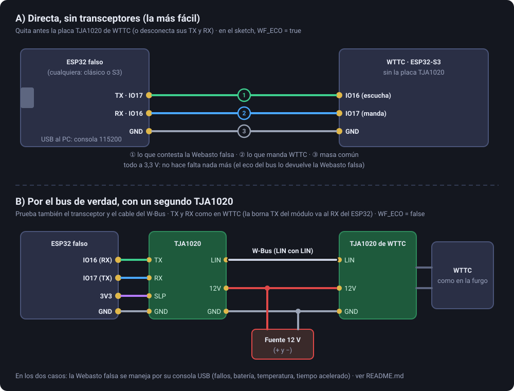

# Webasto falsa: un segundo ESP32 para probar WTTC en la mesa

Un ESP32 cualquiera (el clásico o un S3) que **se hace pasar por una Webasto Thermo Top C** en el W-Bus. Con él se
prueba WTTC de verdad (firmware, web, app, Telegram, termostato, averías…) sin furgoneta, sin gasoil y sin riesgo.

El comportamiento es el mismo modelo que el simulador de la web (fases de arranque, bujía, llama, regulación por
temperatura, pausas, postbarrido, averías y bloqueo), en `webasto_modelo.h`. Es una **aproximación** para probar, no el
comportamiento exacto de una Webasto. GitHub lo prueba en cada cambio junto con el código de WTTC que arma y comprueba
las tramas (`firmware/pruebas/webasto_test.cpp`): arranque, mantenimiento, apagado, averías 02/03/07, bloqueo y regulación.

## Qué hace falta

- Un segundo ESP32 (vale cualquiera con el núcleo ESP32 3.x de Arduino) y un cable USB para él.
- La placa de WTTC.
- Para la conexión B, además: un segundo módulo TJA1020 y una fuente de 12 V.

## Conexión

### A) Directa, sin transceptores (la más fácil)

Solo tres cables, todo a 3,3 V. **Quita antes la placa TJA1020 de WTTC** o desconecta sus TX y RX: los dos no pueden
mandar a la vez por el mismo pin.

| ESP32 falso | WTTC (ESP32-S3) |
|---|---|
| `WF_TX` (IO17) | IO16 (lo que WTTC escucha) |
| `WF_RX` (IO16) | IO17 (lo que WTTC manda) |
| GND | GND |

En `webasto_falsa.ino` deja `WF_ECO = true`. En un bus de un solo hilo cada aparato oye lo que manda, y WTTC lo espera;
sin el bus, ese eco lo devuelve la Webasto falsa.

### B) Por el bus de verdad, con un segundo TJA1020

Más parecido a la furgoneta: prueba también el transceptor y el cable del W-Bus.

- En el ESP32 falso, un TJA1020 cableado **como el de WTTC**: la borna **TX** del módulo (la que manda hacia el ESP32) a `WF_RX` (IO16), la **RX** a `WF_TX` (IO17), SLP a 3V3 y GND a GND.
- Los **LIN** de los dos TJA1020 unidos (ese es el W-Bus), y los dos con **12 V** y **masa** comunes.
- En `webasto_falsa.ino`, `WF_ECO = false` (el eco ya lo da el bus).

Si tu placa no tiene libres IO16/IO17, cambia `WF_RX`/`WF_TX` al principio del sketch.

## Instalar

En el Arduino IDE (núcleo **esp32 de Espressif 3.x**), abre `herramientas/webasto_falsa/webasto_falsa.ino`, elige tu
placa y súbelo. Abre el monitor serie a **115200**: verás las tramas que llegan (←) y lo que contesta (→).

## Consola

| Orden | Qué hace |
|---|---|
| `estado` | agua, dentro, batería, llama, potencia, orden, averías |
| `fuera 0` | temperatura de fuera (°C): afecta a cuánto tarda en calentar |
| `bateria 11.6` | tensión de la batería (V) |
| `fallo gasoil` | no prende: a los dos intentos, avería **02**; a la tercera vez, **bloqueada** (07) |
| `fallo llama` | se le apaga la llama calentando: avería **03** |
| `fallo corriente` | sin corriente (fusible): no contesta a nada |
| `fallo mudo` | el W-Bus no contesta (cable suelto) |
| `fallo ninguno` | quita los fallos |
| `borrar` | borra las averías y la desbloquea |
| `rapido 10` | el tiempo va 10 veces más deprisa (hasta 60): calentar 20 min se ve en 2 |
| `traza off` | deja de escribir cada trama |

## Pruebas para hacer con WTTC

| Prueba | En la Webasto falsa | Lo que tiene que hacer WTTC |
|---|---|---|
| Encender 30 min | — | «Arrancando» → «Con llama» a los ~90 s (o ~9 s con `rapido 10`); gasoil contando; mantenimiento cada 5 s |
| Apagar | — | «Apagada»; la falsa pasa a postbarrido 2 min |
| Encender en el postbarrido | apagar y volver a encender enseguida | «La Webasto está terminando de apagarse: prueba en N s» (la falsa ignoraría la orden, como una de verdad) |
| Sin gasoil | `fallo gasoil` y encender | a los ~3 min, «se apagó sola», avería 0x02 en «Leer averías» y aviso por Telegram; en Mis estadísticas, «Se apagó sola (avería)» |
| Bloqueo | tres veces sin gasoil | avería 0x07; encender ya no prende hasta `borrar` |
| Se apaga la llama | encender, esperar llama, `fallo llama` | «se apagó sola», avería 0x03 |
| Sin corriente | `fallo corriente` y encender | «No se pudo encender: la Webasto no responde por W-Bus»; en Mis estadísticas, «No respondió (W-Bus)» |
| Cable suelto calentando | encender, luego `fallo mudo` | a los 25 s «sin comunicación»; a los 2 min, apagada por falta de comunicación |
| Batería baja | `bateria 11.4` y encender (con batería mínima 12 V) | un programa no arranca; calentando, se apaga sola por batería |
| Termostato | `fuera 5`, «calentar hasta 20 °C» | (sin termómetro de verdad, dentro sigue al aire; el termostato se prueba mejor en el simulador de la web) |
| Reinicio calentando | encender y pulsar RST en WTTC | al arrancar, WTTC apaga la Webasto y lo dice en el registro y la pantalla |
